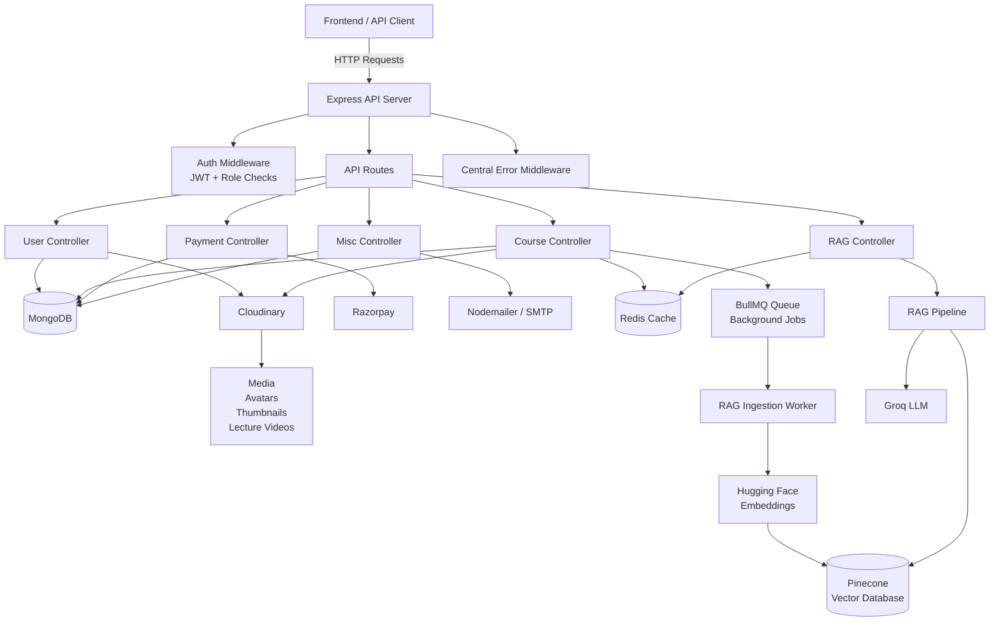

# Simplilearn LMS Backend

A production-style backend for a **Learning Management System (LMS)** built with Node.js, Express.js, MongoDB, Redis, Razorpay, Cloudinary, and an AI-powered RAG module.

This backend provides secure authentication, role-based authorization, course and lecture management, subscription payments, cloud media storage, email services, Redis caching, BullMQ background processing, and AI-powered course discovery.

---

## 🚀 Features

- 🔐 JWT-based authentication
- 👤 User registration, login, logout, profile management, and password reset
- 🛡️ Role-based authorization for users, subscribers, and admins
- 📚 Course creation, updating, deletion, and lecture management
- 🎥 Protected lecture and course content
- 💳 Razorpay subscription payment integration
- ☁️ Cloudinary integration for avatars, thumbnails, and lecture videos
- 📧 Email service using Nodemailer and SMTP
- ⚡ Redis caching for frequently requested data
- 🔄 BullMQ architecture for background processing
- 🤖 AI-powered RAG course search and question answering
- 🧠 Hugging Face embeddings
- 🔎 Pinecone vector search
- ⚡ Groq-powered AI response generation
- 🛑 Centralized error handling
- 🌐 RESTful API architecture
- 📊 Admin user statistics
- 🔒 Secure environment-based configuration

---

## 🛠️ Tech Stack

| Category | Technology |
| --- | --- |
| Runtime | Node.js |
| Backend Framework | Express.js |
| Database | MongoDB |
| ODM | Mongoose |
| Authentication | JWT |
| Password Hashing | bcryptjs |
| Cookies | Cookie Parser |
| File Upload | Multer |
| Cloud Storage | Cloudinary |
| Payments | Razorpay |
| Email | Nodemailer / SMTP |
| Cache | Redis |
| Background Jobs | BullMQ |
| AI Framework | LangChain |
| Embeddings | Hugging Face |
| Vector Database | Pinecone |
| LLM | Groq |
| Logging | Morgan |
| Development | Nodemon |

---

# 🏗️ System Architecture




---

# 🧩 Architecture Overview

The backend follows a modular REST API architecture.

```text
Frontend / API Client
        |
        v
Express Server
        |
        v
Authentication Middleware
        |
        v
Route
        |
        v
Controller
        |
        +--------------------+
        |                    |
        v                    v
     MongoDB              Redis
        |
        v
External Services
        |
        +---- Cloudinary
        |
        +---- Razorpay
        |
        +---- SMTP
        |
        +---- Pinecone
        |
        +---- Groq
        |
        +---- Hugging Face
```

---

# 📁 Project Structure

```text
server/
│
├── app.js
├── server.js
├── package.json
│
├── configs/
│   ├── dbConn.js
│   └── redis.js
│
├── controllers/
│   ├── course.controller.js
│   ├── miscellaneous.controller.js
│   ├── payment.controller.js
│   ├── rag.controller.js
│   └── user.controller.js
│
├── middlewares/
│   ├── asyncHandler.middleware.js
│   ├── auth.middleware.js
│   ├── error.middleware.js
│   └── multer.middleware.js
│
├── models/
│   ├── course.model.js
│   ├── payment.model.js
│   └── user.model.js
│
├── rag/
│   ├── eventIngestion.js
│   ├── generator.js
│   ├── pipeline.js
│   └── retriever.js
│
├── routes/
│   ├── course.routes.js
│   ├── miscellaneous.routes.js
│   ├── payment.routes.js
│   ├── rag.routes.js
│   └── user.routes.js
│
└── utils/
    ├── appError.js
    ├── redisCache.js
    └── sendEmail.js
```

---

# 🔌 API Documentation

## ❤️ Health Check

| Method | Endpoint | Access | Description |
| --- | --- | --- | --- |
| GET | `/ping` | Public | Check server status |

```bash
curl http://localhost:5000/ping
```

Expected response:

```text
Pong
```

---

# 👤 User APIs

Base URL:

```text
/api/v1/user
```

| Method | Endpoint | Access | Description |
| --- | --- | --- | --- |
| POST | `/api/v1/user/register` | Public | Register a new user |
| POST | `/api/v1/user/login` | Public | Authenticate and login |
| GET | `/api/v1/user/logout` | Public | Logout current user |
| GET | `/api/v1/user/me` | Authenticated | Get current user profile |
| POST | `/api/v1/user/reset` | Public | Request password reset |
| POST | `/api/v1/user/reset/:resetToken` | Public | Reset password using token |
| POST | `/api/v1/user/change-password` | Authenticated | Change password |
| PUT | `/api/v1/user/update/:id` | Authenticated | Update user profile |

---

# 📚 Course APIs

Base URL:

```text
/api/v1/courses
```

| Method | Endpoint | Access | Description |
| --- | --- | --- | --- |
| GET | `/api/v1/courses` | Public | List all courses |
| POST | `/api/v1/courses` | Admin | Create a new course |
| GET | `/api/v1/courses/:id` | Subscriber / Admin | Retrieve course and lectures |
| POST | `/api/v1/courses/:id` | Admin | Add lecture to course |
| PUT | `/api/v1/courses/:id` | Admin | Update course |
| DELETE | `/api/v1/courses?courseId=&lectureId=` | Admin | Delete lecture |

---

# 💳 Payment APIs

Base URL:

```text
/api/v1/payments
```

| Method | Endpoint | Access | Description |
| --- | --- | --- | --- |
| GET | `/api/v1/payments/razorpay-key` | Authenticated | Get Razorpay public key |
| POST | `/api/v1/payments/subscribe` | Authenticated | Create subscription |
| POST | `/api/v1/payments/verify` | Authenticated | Verify payment |
| POST | `/api/v1/payments/unsubscribe` | Subscriber | Cancel subscription |
| GET | `/api/v1/payments` | Admin | Get all payments |

---

# 🤖 RAG / AI APIs

Base URL:

```text
/api/v1/rag
```

| Method | Endpoint | Access | Description |
| --- | --- | --- | --- |
| POST | `/api/v1/rag/ask` | Public | Ask an AI question about course content |

---

# 📧 Miscellaneous APIs

| Method | Endpoint | Access | Description |
| --- | --- | --- | --- |
| POST | `/api/v1/contact` | Public | Send contact form email |
| GET | `/api/v1/admin/stats/users` | Admin | Get user statistics |

---

# 🔐 Authentication

The application uses JWT-based authentication and role-based authorization.

```text
User
 |
 v
Register / Login
 |
 v
Validate Credentials
 |
 v
Generate JWT
 |
 v
Authenticated Request
 |
 v
Authentication Middleware
 |
 v
Verify JWT
 |
 v
Check User Role
 |
 v
Protected Controller
 |
 v
Response
```

Supported access levels include:

```text
User
Subscriber
Admin
```

---

# 📤 File Upload Architecture

Multer handles incoming file uploads and Cloudinary provides cloud storage.

```text
Frontend
    |
    | multipart/form-data
    v
Multer Middleware
    |
    v
File Processing
    |
    v
Cloudinary
    |
    v
Cloudinary URL
    |
    v
MongoDB
```

Cloudinary is used for:

- User avatars
- Course thumbnails
- Lecture videos

---

# 💳 Payment Architecture

Razorpay is used to handle subscription payments.

```text
Frontend
    |
    v
Create Subscription
    |
    v
Backend
    |
    v
Razorpay
    |
    v
Payment
    |
    v
Payment Verification
    |
    v
Backend
    |
    v
MongoDB
    |
    v
Subscription Activated
```

The Razorpay secret must remain on the backend and must never be exposed to the frontend.

---

# ⚡ Redis Architecture

Redis is used for caching frequently accessed information and supporting BullMQ.

```text
Client
  |
  v
API
  |
  v
Check Redis
  |
  +------ Cache Hit ------> Return Cached Data
  |
  +------ Cache Miss
             |
             v
          MongoDB
             |
             v
        Store in Redis
             |
             v
        Return Response
```

Redis can be used for:

- Course caching
- RAG response caching
- Frequently requested data
- BullMQ queue infrastructure

---

# 🔄 BullMQ Background Processing

BullMQ provides a queue-based architecture for heavy asynchronous tasks.

```text
API Request
     |
     v
Controller
     |
     v
BullMQ Queue
     |
     v
Redis
     |
     v
Background Worker
     |
     v
Heavy Processing
```

Possible background tasks include:

- RAG document ingestion
- Embedding generation
- Vector database updates
- Email processing
- Other long-running jobs

---

# 🤖 AI / RAG Architecture

The project includes an AI-powered RAG pipeline for intelligent course discovery and question answering.

Technologies used:

```text
LangChain
Hugging Face
Pinecone
Groq
Redis
BullMQ
```

## RAG Ingestion Flow

```text
Course Content
      |
      v
BullMQ Queue
      |
      v
RAG Ingestion Worker
      |
      v
Hugging Face Embeddings
      |
      v
Pinecone Vector Database
```

## RAG Question Answering Flow

```text
User Question
      |
      v
RAG API
      |
      v
RAG Pipeline
      |
      v
Pinecone Similarity Search
      |
      v
Relevant Course Context
      |
      v
Groq LLM
      |
      v
AI Generated Answer
```

Redis can be used to cache repeated questions and responses.

---

# 🗄️ Database

MongoDB is used as the primary application database.

Default local connection:

```text
mongodb://127.0.0.1:27017/lms
```

MongoDB stores:

- Users
- Courses
- Lectures
- Payments
- Subscription information

Mongoose is used as the MongoDB ODM.

---

# ⚙️ Environment Variables

Create a `.env` file inside the `server/` directory.

```env
PORT=5000
NODE_ENV=development

# Frontend
FRONTEND_URL=http://localhost:5173

# Database
MONGO_URI=mongodb://127.0.0.1:27017/lms

# Redis / BullMQ
REDIS_URL=redis://127.0.0.1:6379
REDIS_HOST=127.0.0.1
REDIS_PORT=6379

# JWT
JWT_SECRET=your_jwt_secret
JWT_EXPIRY=7d

# Cloudinary
CLOUDINARY_CLOUD_NAME=your_cloud_name
CLOUDINARY_API_KEY=your_api_key
CLOUDINARY_API_SECRET=your_api_secret

# Razorpay
RAZORPAY_KEY_ID=your_razorpay_key_id
RAZORPAY_SECRET=your_razorpay_secret

# Email / SMTP
SMTP_HOST=smtp.example.com
SMTP_PORT=587
SMTP_USERNAME=your_email
SMTP_PASSWORD=your_password
SMTP_FROM_EMAIL=no-reply@example.com

# AI / RAG
HF_API_KEY=your_hugging_face_key
PINECONE_API_KEY=your_pinecone_key
PINECONE_INDEX_NAME=lms
GROQ_API_KEY=your_groq_key
```

---

# 📋 Environment Variable Reference

| Variable | Purpose |
| --- | --- |
| `PORT` | Backend server port |
| `NODE_ENV` | Application environment |
| `FRONTEND_URL` | Frontend application URL |
| `MONGO_URI` | MongoDB connection string |
| `REDIS_URL` | Redis connection URL |
| `REDIS_HOST` | Redis hostname |
| `REDIS_PORT` | Redis port |
| `JWT_SECRET` | Secret used for JWT signing |
| `JWT_EXPIRY` | JWT expiration duration |
| `CLOUDINARY_CLOUD_NAME` | Cloudinary cloud name |
| `CLOUDINARY_API_KEY` | Cloudinary API key |
| `CLOUDINARY_API_SECRET` | Cloudinary API secret |
| `RAZORPAY_KEY_ID` | Razorpay public key |
| `RAZORPAY_SECRET` | Razorpay secret |
| `SMTP_HOST` | SMTP server |
| `SMTP_PORT` | SMTP server port |
| `SMTP_USERNAME` | SMTP username |
| `SMTP_PASSWORD` | SMTP password |
| `SMTP_FROM_EMAIL` | Email sender |
| `HF_API_KEY` | Hugging Face API key |
| `PINECONE_API_KEY` | Pinecone API key |
| `PINECONE_INDEX_NAME` | Pinecone index |
| `GROQ_API_KEY` | Groq API key |

> **Important:** Never commit real API keys, passwords, JWT secrets, or `.env` files to GitHub.

---

# 📋 Prerequisites

Before running the project, install:

- Node.js
- npm
- MongoDB
- Redis

External services required for their respective features:

- Cloudinary
- Razorpay
- SMTP provider
- Hugging Face
- Pinecone
- Groq

---

# 🚀 Installation

## 1. Clone the Repository

```bash
git clone <your-repository-url>
```

## 2. Navigate to the Backend

```bash
cd <repository-name>/server
```

## 3. Install Dependencies

```bash
npm install
```

## 4. Configure Environment Variables

Create:

```text
server/.env
```

Add the required environment variables shown above.

## 5. Start MongoDB

Make sure MongoDB is running locally or provide a valid MongoDB connection string.

## 6. Start Redis

Make sure Redis is running locally.

## 7. Start the Server

Development:

```bash
npm run dev
```

Production:

```bash
npm start
```

---

# 🌐 Server URL

After starting the server:

```text
http://localhost:5000
```

Health check:

```text
http://localhost:5000/ping
```

Expected response:

```text
Pong
```

---

# 📜 Available Scripts

| Command | Description |
| --- | --- |
| `npm run dev` | Start development server with Nodemon |
| `npm start` | Start production server |

---

# 🛡️ Error Handling

The backend uses centralized error handling.

The error handling architecture includes:

- Custom `AppError` class
- `asyncHandler` middleware
- Central error middleware
- Consistent API error responses
- Production-safe error handling

Flow:

```text
Request
   |
   v
Route
   |
   v
Controller
   |
   +-------- Success --------> Response
   |
   +-------- Error
              |
              v
        asyncHandler
              |
              v
       Error Middleware
              |
              v
        Error Response
```

---

# 🔒 Security

The backend implements:

- JWT authentication
- Role-based authorization
- Password hashing with bcryptjs
- Protected admin routes
- Cookie support
- CORS configuration
- Server-side payment verification
- Environment-based secret management
- Centralized error handling

For production deployment, consider adding:

- HTTPS
- Rate limiting
- Security headers
- Strong request validation
- Request size limits
- Production monitoring
- Secure cookie configuration

---

# 📧 Email Service

Nodemailer and SMTP are used for email-related functionality.

Contact endpoint:

```text
POST /api/v1/contact
```

SMTP configuration is controlled through environment variables.

---

# ☁️ Cloudinary

Cloudinary provides cloud-based media storage.

Used for:

```text
User Avatars
Course Thumbnails
Lecture Videos
```

Cloudinary credentials must be stored in environment variables.

---

# 💰 Razorpay

Razorpay is used for subscription payment processing.

```text
Subscription Creation
        |
        v
Payment
        |
        v
Payment Verification
        |
        v
Subscription Status
        |
        v
MongoDB
```

The Razorpay secret is server-side only.

---

# 🧪 Testing

The API can be manually tested using:

- Postman
- Insomnia
- Thunder Client

Recommended automated testing tools:

- Jest
- Vitest
- Supertest

Important areas for testing:

- User registration
- User login
- Authentication
- Authorization
- Course management
- Lecture access
- Payments
- Payment verification
- RAG question answering
- Contact form
- Admin APIs
- Error handling

---

# 🔍 Troubleshooting

## MongoDB Connection Error

Check:

- MongoDB is running.
- `MONGO_URI` is correct.
- MongoDB is accessible.

Default:

```text
mongodb://127.0.0.1:27017/lms
```

## Redis Connection Error

Check:

- Redis is running.
- `REDIS_HOST` is correct.
- `REDIS_PORT` is correct.
- `REDIS_URL` is correct.

Default:

```text
redis://127.0.0.1:6379
```

## Cloudinary Upload Error

Check:

- Cloudinary cloud name
- Cloudinary API key
- Cloudinary API secret
- File size
- File format

## Razorpay Payment Error

Check:

- Razorpay key ID
- Razorpay secret
- Payment verification logic
- Razorpay configuration
- Test/live environment settings

## Email Error

Check:

- SMTP host
- SMTP port
- SMTP username
- SMTP password
- Sender email
- SMTP provider configuration

## RAG / AI Error

Check:

- Hugging Face API key
- Pinecone API key
- Pinecone index name
- Groq API key
- Redis connection
- Pinecone configuration
- Embedding configuration

---

# 📈 Why This Project Stands Out

This project demonstrates more than basic CRUD APIs.

It combines:

- Authentication
- Authorization
- REST API architecture
- MongoDB
- Redis
- BullMQ
- Cloudinary
- Razorpay
- SMTP email
- AI
- RAG
- Vector search
- Background processing
- Role-based administration
- Centralized error handling

The project demonstrates how multiple backend technologies can work together in a real-world LMS architecture.

---

# 🧠 Backend Design Principles

## Separation of Concerns

Responsibilities are separated into:

```text
Routes
Controllers
Models
Middleware
Utilities
RAG
Configuration
```

## Asynchronous Processing

Heavy tasks can be moved into BullMQ background jobs instead of blocking API requests.

## Caching

Redis reduces repeated database and AI/vector-search operations.

## External Service Isolation

External services such as:

```text
Cloudinary
Razorpay
SMTP
Pinecone
Groq
Hugging Face
```

are accessed through backend logic and environment-based configuration.

## Security

Secrets and credentials are stored outside the source code using environment variables.

---

# 🔮 Future Improvements

- [ ] Add automated unit tests
- [ ] Add integration tests
- [ ] Add Swagger/OpenAPI documentation
- [ ] Add Docker Compose
- [ ] Add dedicated BullMQ worker process
- [ ] Add BullMQ dashboard
- [ ] Add API rate limiting
- [ ] Improve request validation
- [ ] Add structured logging
- [ ] Add production monitoring
- [ ] Improve RAG retrieval quality
- [ ] Add RAG evaluation
- [ ] Add CI/CD with GitHub Actions
- [ ] Add production deployment documentation

---

# 🤝 Contributing

Contributions are welcome.

## 1. Create a feature branch

```bash
git checkout -b feature/your-feature
```

## 2. Make your changes

Implement and test your changes locally.

## 3. Commit your changes

```bash
git commit -m "feat: add your feature"
```

## 4. Push your branch

```bash
git push origin feature/your-feature
```

## 5. Create a Pull Request

Open a Pull Request and describe your changes.

---

# 📄 License

This project is available under the MIT License.

---

# 👨‍💻 Author

Built as a full-stack LMS backend project to demonstrate:

- Scalable API architecture
- Secure authentication
- Role-based authorization
- Course and lecture management
- Payment integration
- Cloud media storage
- Redis caching
- BullMQ background processing
- AI-powered course discovery
- RAG architecture
- Vector database integration

---

# ⭐ Project Summary

**Simplilearn LMS Backend** is a production-style Learning Management System backend that combines traditional backend engineering with modern infrastructure and AI capabilities.

The system provides:

```text
Authentication
     +
Authorization
     +
Course Management
     +
Lecture Management
     +
Payments
     +
Cloud Storage
     +
Email
     +
Redis Cache
     +
BullMQ
     +
RAG
     +
Vector Search
     +
AI
```

These components work together to provide a scalable foundation for a modern LMS frontend built with React, Next.js, or another frontend framework.

---

# 🚀 Quick Start

```bash
cd server
npm install
npm run dev
```

Server:

```text
http://localhost:5000
```

Health check:

```bash
curl http://localhost:5000/ping
```

Response:

```text
Pong
```

---

## ⭐ If You Like This Project

If this project helped you or you found the architecture useful, consider giving the repository a ⭐ on GitHub.
